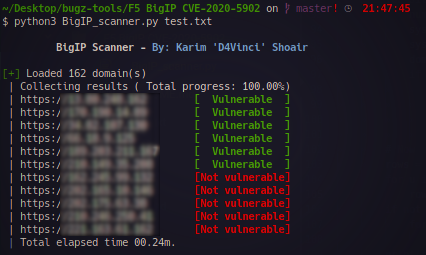

# F5 BigIP Scanner
Scan for F5 BIG-IP servers in a given list and check them against CVE-2020-5902.

But not like other lazy scripts this one scans all domains at the same time using concurrency, finds BigIP servers by fingerprinting the title and favicon and can take specific headers so you can scan virtual hosts for example :smile:

# Screenshot
</img>

## Usage
```
BigIP_scanner.py [-h] [--headers HEADERS] [--check-only] [-o O] Domains_file

positional arguments:
  Domains_file       File of domains file to work with

optional arguments:
  -h, --help         show this help message and exit
  --headers HEADERS  Headers you want to add to requests(ex: 'Host: 127.0.0.1')
  --check-only       Don't try to detect BIGIP servers from the file and check against CVE-2020-5902 only
  -o                 Output the vulnerable domains to a file.
```

## Requirements
- Python 3.x
- mmh3, terminaltables modules `pip3 install mmh3 terminaltables`
