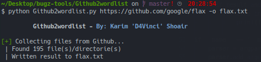

# Github2wordlist
Takes a Github repo url and makes a wordlist from it for content discovery. No Github api key needed.

# Screenshot
</img>

## Usage
```
Github2wordlist.py [-h] [--no-recursion] [-o] repo

positional arguments:
  repo            https link of the github repo you want to work on.

optional arguments:
  -h, --help      show this help message and exit
  --no-recursion  Omit this parameter to prevent recursively returning objects or subtrees.
  -o              The output path of the wordlist
```

## Requirements
- Python 3.6+
