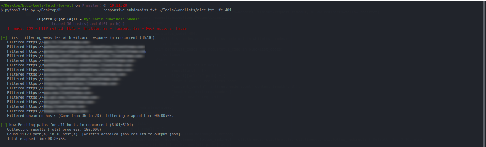
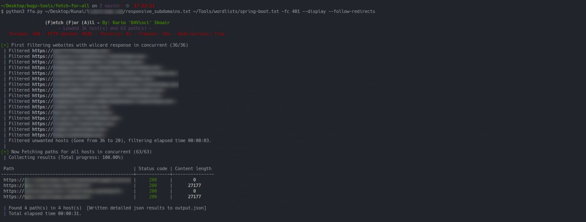

# (F)etch (F)or (A)ll
A very customizable tool for fetching many paths for many hosts/domains very fast using concurrency without much stress on hosts/domains.

- **How it work?**

FFA takes a list of hosts/domains and list of paths (in any format) then checks the given targets for wild-card responses to save time then loops over the given paths and fetch every target with the current path then finally saves the status code, content length and response headers for each path in JSON file and display this result if you want without headers!

- **How far FFA is customizable?**

If you look in the command-line arguments bellow, you would notice that you can specify a custom HTTP headers, set HTTP method, set HTTP request timeout, choose to follow redirections or not, set a time to sleep between requests if there's rate-limiting, and finally you can filter results by status code. It does all of that and still faster than others!

# Screenshots
<table>
  <tr>
  <th>Test</th>
    <th><center>⚡ <b>FFA against (36*6101) URL to fetch</b> ⚡ </center></th>
    <th><center>⚡ <b>FFA against (36*63) URL to fetch</b> ⚡</center></th>
  </tr>
  <tr>
  <th>POC</th>
    <td></td>
    <td></td>
    <!-- Wanted to put a picture of meg to compare ahahahaa-->
  </tr>
  <tr>
  <th>Time</th>
    <td><center><b>27 Minutes</b></center></td>
    <td><center><b>34 Seconds</center></b></td>
  </tr>
</table>

## Usage
```
ffa.py [-h] [-hh] [-m] [-c] [-r] [-d] [-a] [-t] [-s] [-mc  [...]] [-fc  [...]] [-o] hosts paths

positional arguments:
  hosts                 File of hosts/domains file to work with
  paths                 File of paths file to test on

optional arguments:
  -h,  --help                  show this help message and exit
  -hh, --headers               Headers you want to add to requests(ex: 'Host: 127.0.0.1')
  -m,  --method                HTTP method (default: HEAD)
  -c,  --threads               The number of maximum concurrent threads to use (Default: 100)
  -r,  --follow-redirects      Follow redirects for all sent requests (Default: not allowed)
  -d,  --display               Display less detailed output in the terminal without much noise.
  -a,  --all-hosts             Don't check for wildcard responses, fetch all!
  -t,  --timeout               Request timeout for each single request (Default: 10)
  -s,  --throttle              Time to wait between each request (By default no throttling)
  -mc, --match-codes  [...]    Whitelisting filter, returns results with given status codes (separated with space)
  -fc, --filter-codes [...]    Blacklisting filter, don't return results with given status codes (separated with space)
  -o,  --output                JSON output file name.
```

## Requirements
- Python 3.6+
- terminaltables module `pip3 install terminaltables`
